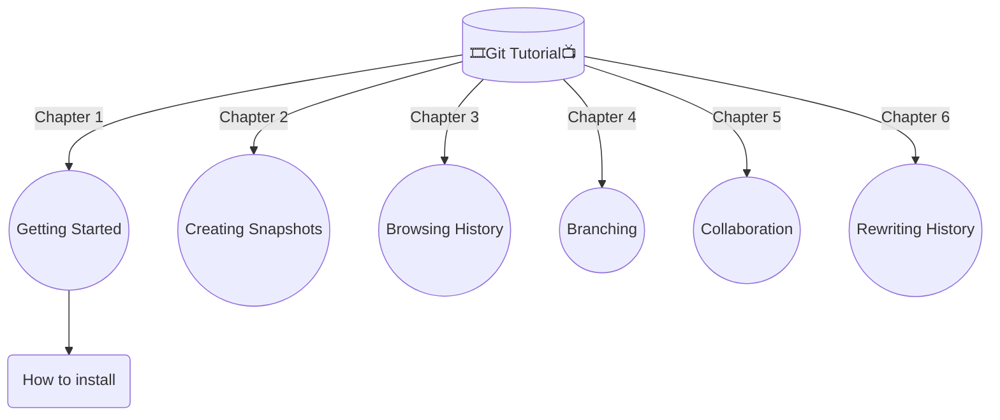

```mermaid
flowchart TD
A[("🎞️Git Tutorial📺")] -- Chapter 1 --> B((Getting Started))
A -- Chapter 2 --> C((Creating Snapshots))
A -- Chapter 3 --> D((Browsing History))
A -- Chapter 4 --> E((Branching))
A -- Chapter 5 --> F((Collaboration))
A -- Chapter 6 --> G((Rewriting History))
B --> H(How to install)
```

